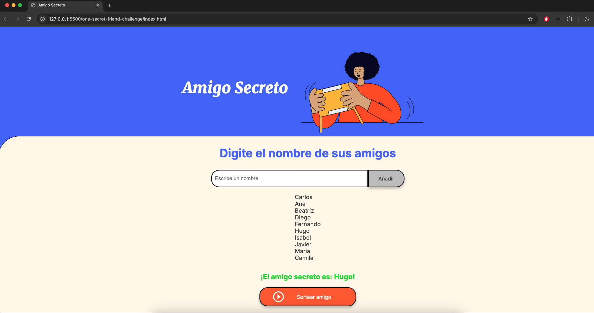

# Secret Friend

## Description

This is a simple **Secret Friend** game where users can add the names of their friends and randomly draw one to make the game more fun. The project is built using **HTML**, **CSS**, and **JavaScript**.

## Features

- **Add Friends**: Users can type a friend's name into the input field and click "Add" or press "Enter" to add it to the list.
- **Draw Secret Friend**: Users can click on the "Draw Friend" button to randomly select a name from the list of friends.
- **Display List**: Added names are displayed in a list, and the drawn Secret Friend is shown in a highlighted section.

## Technologies

- HTML
- CSS
- JavaScript

## Installation

Clone this repository to your local machine:
   ```bash
   git clone https://github.com/JoniMora/one-secret-friend-challenge
   ```


